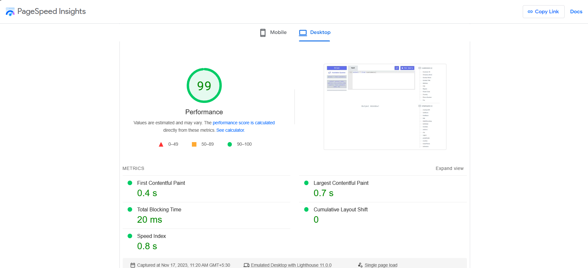
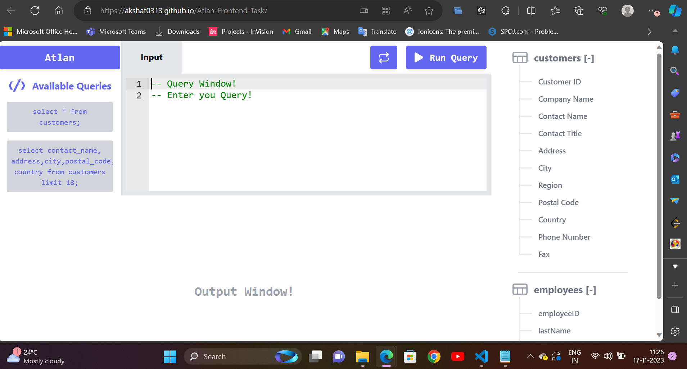

# 💻 Atlan Frontend Task

## 📚 Description

Create, design and implement a web-based application capable of running SQL queries and displaying the results of said query. The application must include a space which accepts SQL queries in the form of user inputs, then runs the given query, and displays the result within the application..

This is a Atlan Frontend Task(a SQL query editor project) built using ReactJs and TailwindCSS.

## 👨‍💻 Live Demo

Working Demo : [Atlan Frontend Task](https://akshat0313.github.io/Atlan-Frontend-Task/)

## 👨‍🔧 Tech Stack

## ⚙️ Dependencies

- **_react-ace_**
- **_react-csv_**
- **_react-hot-toast_**
- **_tailwind-scrollbar-hide_**

## 👨‍💻 Features

:white_check_mark: Users can get data of any of the Available SQL queries on the left Sidebar menu.\
:white_check_mark: Users can view all the table column on Right Sidebar menu.\
:white_check_mark: Users can check all the table value on clicking Table name of Right Sidebar menu.\
:white_check_mark: Users can download the data in CSV Format in just one click.\
:white_check_mark: Users can see query's output in milliseconds(ms).

## ✍️ Available SQL Queries

- `select * from customers;`
- `select * from employees;`
- `select * from orders;`
- `select contact_name, address,city,postal_code, country from customers limit 18;`

## ⏱ Page Load Time

Page Load time of this website in desktop is in the range of 0.4 s to 0.6s.
we can check code spnappyness using GTmetrix Grade.

### [web.dev Report](https://pagespeed.web.dev/analysis/https-akshat0313-github-io-Atlan-Frontend-Task/l2nnec46wd?form_factor=mobile)

Laptop performance view

## 🪜 Optimization steps

- Used Lighthouse DevTools Extension to find the performance issues and fix them using their actionable suggestion.

## Available Scripts

In the project directory, you can run:

### `npm install`

To install all the packages in package.json. This will install all the dependencies and devDependencies.

### `npm start`

Runs the app in the development mode.\
Open [http://localhost:3000](http://localhost:3000) to view it in the browser.

The page will reload if you make edits.\
You will also see any lint errors in the console.

### `npm run build`

Builds the app for production to the `build` folder.\
It correctly bundles React in production mode and optimizes the build for the best performance.

The build is minified and the filenames include the hashes.\
Your app is ready to be deployed!

Deployment is done using Github Pages

More info [deployment](https://github.com/gitname/react-gh-pages)

## Note: Brownie points achieved by rendering a table with over 800 rows.

## 🚀 Project Output

